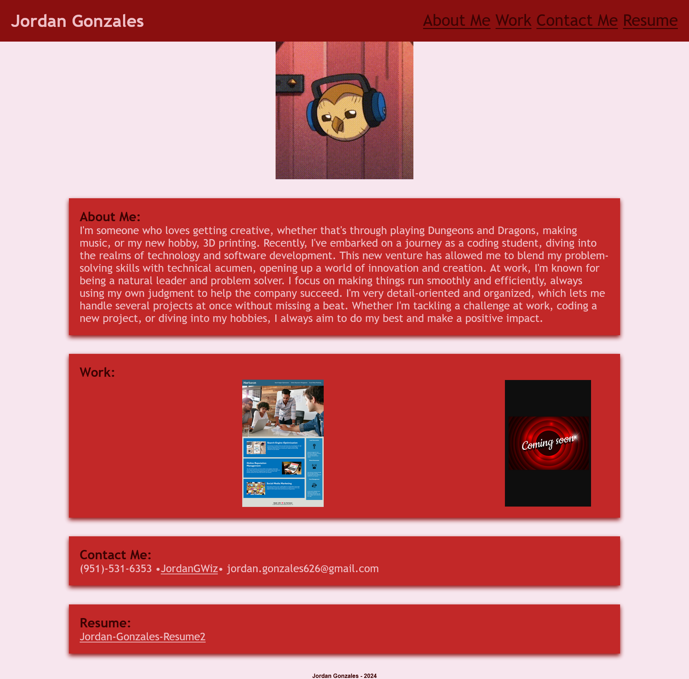

# Jordan-Dev-Design

## Description

This is my developer portfolio where I share the coding projects I'm proud of.I built this site because I wanted a place to share my work and connect with others who are interested in coding and/or future employers.

### My portfolio is built to be both dynamic and responsive, highlighting my development journey and the skills I have acquired.

-I used flexbox to make clean and flexible layouts, helping keep the site well-organized.

-I used media queries to make sure the site works well on different devices, from phones to desktops.

-I used CSS variables to easily keep the style of the site consistent.

As I continue to develop my skills and gain more experience, this portfolio will be continuously updated to showcase my expanding skills in web development..

## Usage

[Link to Deployed Website]()

## Collaborators

This project was made possible with the help of:

[Kaila Ronquillo](https://github.com/girlnotfound)

[Adam Rosenberg](https://github.com/AcoderRose)
